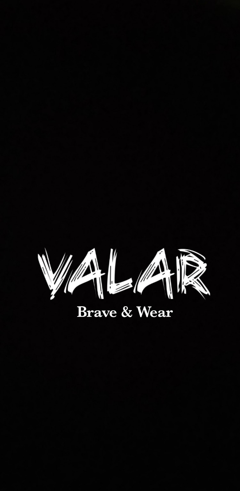

  

  <strong>BRAVE & WEAR</strong>

  Fashion built for those who dare to stand out.

  <a href="https://valarbravewear.github.io/valar/">
    <strong>Visit VALAR Website →</strong>
  </a>

About VALAR

VALAR is a clothing brand focused on bold, modern fashion designed for people who want to express confidence, individuality, and character through what they wear.

This repository contains the source code for the VALAR website and its related web components.

🌐 Live Website

VALAR — Brave & Wear

https://valarbravewear.github.io/valar/

✨ Features

- Modern VALAR clothing storefront
- Responsive design for mobile and desktop
- Product browsing
- Product categories
- Product details
- Shopping/order functionality
- Customer order information
- Multiple payment options
- VALAR-branded user interface
- Admin management system
- Supabase-powered backend

💳 Payment Options

VALAR supports the following payment methods:

- Airtel Money
- Mpamba
- Visa Card
- Cash

🛠️ Technologies

This project uses:

- HTML5
- CSS3
- JavaScript
- Supabase
- GitHub Pages

📁 Project Structure

valar/
├── assets/
│   ├── valar-logo-light.jpg
│   └── ...
├── admin/
│   └── ...
├── index.html
├── config.js
├── style.css
├── script.js
└── README.md

🔐 Backend

VALAR uses Supabase for backend services, including product and order data.

Sensitive credentials such as Supabase secret/service-role keys should never be placed in frontend files or committed to this repository.

🚀 Deployment

The website is deployed using GitHub Pages.

Live site:

https://valarbravewear.github.io/valar/

🎨 Brand

VALAR

BRAVE & WEAR

Bold clothing. Strong identity. Wear your character.

---

📞 Contact

For VALAR business and brand enquiries, please contact the VALAR team through the official website.

📄 License

This project and its branding, images, designs, and other original content belong to VALAR unless otherwise stated.

© VALAR — Brave & Wear. All rights reserved.
